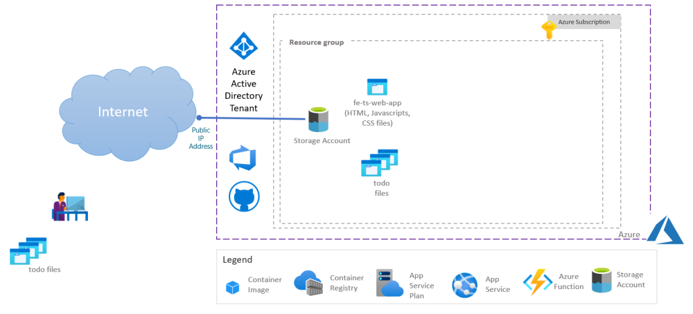
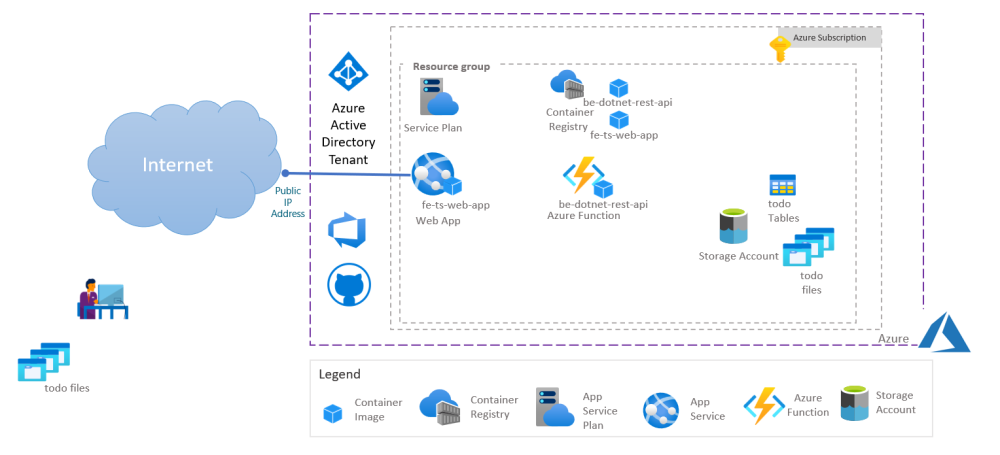
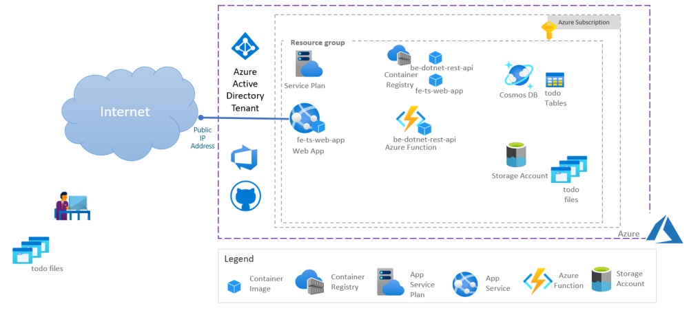
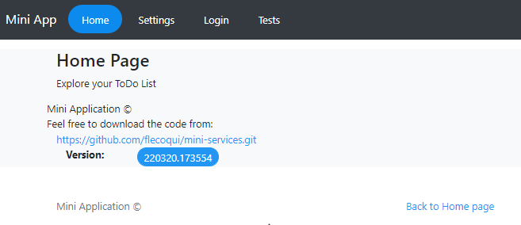
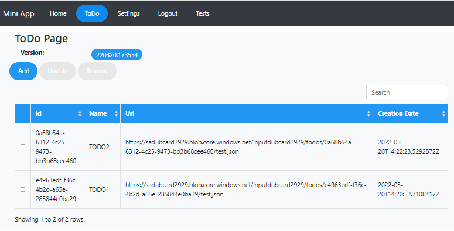
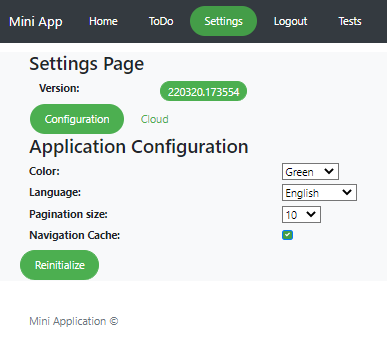
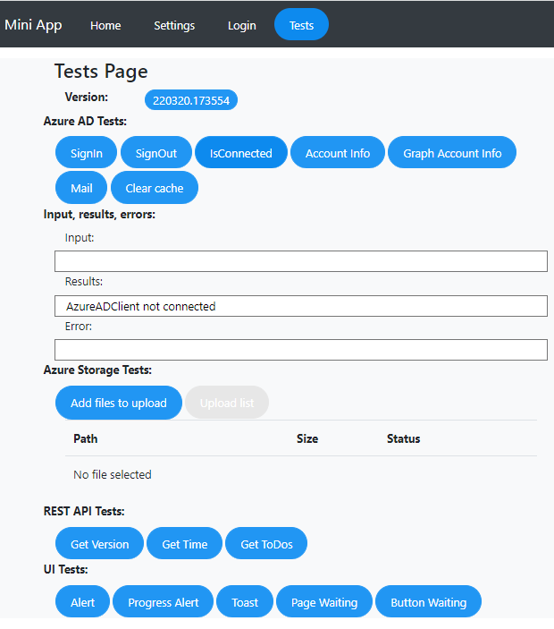

# mini-services
This repository contains a full lightweight service running on Azure.
This service includes:
- a **frontend** based on Typescript Single Page Web Application which can be hosted either on Azure Storage Account under $web folder or in a Container in Azure App Service, Azure Container Instance or Azure Kebernetes Service
- a **backend** based on .Net Core version 6.X exposing a REST API which can be hosted in a container running on Azure Function.
- the **frontend** can also upload files on Azure Storage.
- all the authencation mechanisms are based on Azure Managed Identity
- the **frontend** is based on a Typescript project using bootstrap CSS. Though it's a basic frontend it supports Web UI configuration, localization, Azure AD Authentication, Access to Azure Storage to upload or download files, Access to the REST API with Authentication token. 
- the users can be authentified with Azure AD

This initiative is still a work in progress, for instance, the frontend needs to be updated to support bootstrap version 5.0. 

## Basic Architecture
The Basic architecture only deploys the frontend in a $web folder of an Azure Storage.

## Dev Architecture
The Dev architecture only deploys:
- the frontend in a container running in Azure App Service
- the backend in a container running in Azure Functions
- the database in an Azure Storage Table

## Prod Architecture
The Prod architecture only deploys:
- the frontend in a container running in Azure App Service
- the backend in a container running in Azure Functions
- the database in an Azure CosmosDB

## Dev Container

Check document [here](./docs/devcontainer.md)

## infrastructure Deployment

Check document [here](./docs/deployinfra.md)

## User Experience

Below some screenshots related to the User Experience using the frontend application:

### Home Page

### ToDo Page

This page is used to create, update and remove ToDo items which include a link to a file loaded on Azure Storage while creating the item.

### Settings Page

The settings page allows the user to change the Application Theme, the default language, the pagination size and the use of cache or not.

### Settings Page

This page is used to test the following topics:
- Azure AD Authentication (login/logout)
- Access to Azure Storage to upload files
- Access to the REST API with authentication token
- Test some UI elements 

## Next steps:
Frontend:
- Improve frontend to support bootstrap version 5.0
- Improve checkbox, radio button and combobox style
- Remove if possible jquery dependencies
- Add audio player
- Add video player
- Add picture player

Backend:
- Add REST API in Python
- Add REST API in Typescript

DevOps:
- Unit tests in github action and Azure DevOps pipeline

Samples:
- Add a sample service to play audio, video and picture files stored on a Azure Storage. 
