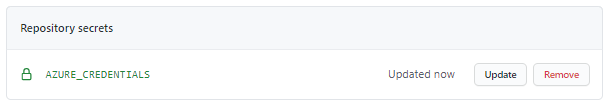
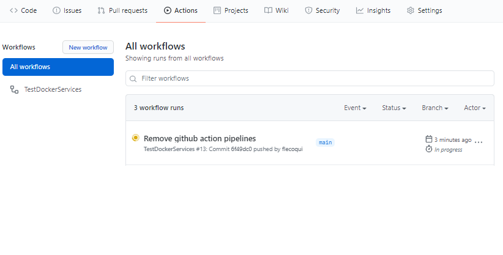

# Deploying the infrastructure

## Deploying the infrastructure manually 
Once the pre-requisites are installed, you can deploy the infrastructure manually.

1. Edit the file configuration/.default.env to define the Azure Region (AZURE_REGION), Azure Subscription (AZURE_SUBSCRIPTION_ID) and the Azure Tenant id (AZURE_TENANT_ID) for your deployment. Moreover, you can define the Application prefix (AZURE_APP_PREFIX) used to name the Azure resources, by default the value is "mini01".

```bash
  AZURE_SUBSCRIPTION_ID="to be completed"
  AZURE_TENANT_ID="to be completed"
  AZURE_REGION="eastus2"
  AZURE_APP_PREFIX="mini02"
```

2. Run the following command in the dev container shell to establish a connection with Azure

```bash
    ./pipelines/utils/minitool.sh -a login
```

3. Once connected, run the following command to deploy the infrastructure without CosmosDB 

```bash
    ./pipelines/utils/minitool.sh -a deploy
```
If you want the CosmosDB Service as well use the command line below:
```bash
    ./pipelines/utils/minitool.sh -a deploycosmos
```

4. After the few minutes the infrastructure is deployed.
  
## Undeploying the infrastructure manually 
Once the infrastructure is deployed, you can undeploy the infrastructure manually.

1. Run the following command in the dev container shell to establish a connection with Azure

```bash
    ./pipelines/utils/minitool.sh -a login
```

3. Once connected, run the following command to deploy the infrastructure 

```bash
    ./pipelines/utils/minitool.sh -a undeploy
```

4. After the few minutes the infrastructure is undeployed.


## Using Github Action pipelines to deploy the infrastructure
This chapter describes how to automate the infrastructure deployment
Currently the repository contains the following pipelines:

- Github Action pipeline to deploy infrastructure
- Github Action pipeline to undeploy infrastructure

### Creating the Service Principal for the pipelines Azure Authentication  
For the following pipelines, an authentication with Azure is required:
- Github Action pipeline to deploy infrastructure
- Github Action pipeline to undeploy infrastructure

The deployment of the infrastructure from a github action requires the creation of a service principal.

In order to create this service principal you can use the following bash file: [pipelines/utils/createrbacsp.sh](pipelines/utils/createrbacsp.sh)

Before running this bash file you need to be connected with your Azure Account using Azure CLI. Run 'az login' in your linux environment.

```bash
    az login
```

Once you are connected with Azure, you can run the following bash to create the Service Principal:

```bash
    pipelines/utils/createrbacsp.sh -s <Azure-Subscription-Id> -a <Service-Principal-Name>
```
where \<Azure-Subscription-Id\> is the subscriptionId of your Azure Account and \<Service-Principal-Name\> the name of the service principal which will be created. 
This bash file will display all the information required for the Azure authentication with github Action pipeline and Azure DevOps pipeline.

For instance:
```bash
    pipelines/utils/createrbacsp.sh -s d3814ade-afe8-4260-9b5f-************ -a sp-av-service
```

The bash file will display the following information:
```bash
    Creating Service Principal for:
    Service Principal Name: sp-av-service
    Subscription: ********-****-****-****-************
    TenantId : ********-****-****-****-************

    Create Service Principal:

    WARNING: The output includes credentials that you must protect. Be sure that you do not include these credentials in your code or check the credentials into your source control. For more information, see https://aka.ms/azadsp-cli
    Service Principal created: ********-****-****-****-************
    Service Principal secret: ************
    Service Principal objectId: ********-****-****-****-************
    API_Microsoft_GraphId: 6a912336-0d0c-4caa-826c-9056b262adf6
    API_Windows_Azure_Active_DirectoryId: 02a23de7-025e-4637-a30a-f56d585b9224
    PERMISSION_MG_Application_ReadWrite_OwnedBy: 18a4783c-866b-4cc7-a460-3d5e5662c884
    PERMISSION_AAD_Application_ReadWrite_OwnedBy: 824c81eb-e3f8-4ee6-8f6d-de7f50d565b7


    Assign role "Owner" to service principal

    Information for the creation of an Azure DevOps Service Connection:

    Service Principal Name: sp-av-service
    Subscription: ********-****-****-****-************
    Subscription Name: ************
    AppId: ********-****-****-****-************
    Password: ************
    TenantID: ********-****-****-****-************


    Information for the creation of Github Action Secret AZURE_CREDENTIALS:

    {
    "clientId": "********-****-****-****-************",
    "clientSecret": "************",
    "subscriptionId": "********-****-****-****-************",
    "tenantId": "********-****-****-****-************",
    "activeDirectoryEndpointUrl": "https://login.microsoftonline.com",
    "resourceManagerEndpointUrl": "https://management.azure.com/",
    "activeDirectoryGraphResourceId": "https://graph.windows.net/",
    "sqlManagementEndpointUrl": "https://management.core.windows.net:8443/",
    "galleryEndpointUrl": "https://gallery.azure.com/",
    "managementEndpointUrl": "https://management.core.windows.net/"
    }
```
The section below will be used for the Azure authentication from a Github Action pipeline:
```bash

    Information for the creation of Github Action Secret AZURE_CREDENTIALS:

    {
    "clientId": "********-****-****-****-************",
    "clientSecret": "************",
    "subscriptionId": "********-****-****-****-************",
    "tenantId": "********-****-****-****-************",
    "activeDirectoryEndpointUrl": "https://login.microsoftonline.com",
    "resourceManagerEndpointUrl": "https://management.azure.com/",
    "activeDirectoryGraphResourceId": "https://graph.windows.net/",
    "sqlManagementEndpointUrl": "https://management.core.windows.net:8443/",
    "galleryEndpointUrl": "https://gallery.azure.com/",
    "managementEndpointUrl": "https://management.core.windows.net/"
    }
```
The section below will be used for the Azure authentication from an Azure DevOps pipeline:
```bash

    Information for the creation of an Azure DevOps Service Connection:

    Service Principal Name: sp-av-service
    Subscription: ********-****-****-****-************
    Subscription Name: ************
    AppId: ********-****-****-****-************
    Password: ************
    TenantID: ********-****-****-****-************
```

If you face the error below, when you run the bash file file pipelines/utils/createrbacsp.sh, you need to contact your Azure AD Administrator to create the Service Principal for you using the same bash file.

```bash
    ERROR: Operation failed with status: 'Bad Request'. Details: 400 Client Error: Bad Request for url: https://graph.windows.net/72f988bf-86f1-41af-91ab-2d7cd011db47/oauth2PermissionGrants?api-version=1.6

    An error occured exiting from createrbacsp.sh bash
```

Once the service principal is created, you can now create the Github Action pipeline and the Azure DevOps pipeline.

### Github Action pipeline
You can use Github Action to automate the deployment of your infrastructure.

First, you need to create the Github Action Secret AZURE_CREDENTIALS for the authentication with Azure.
#### Create Github Action Secret AZURE_CREDENTIALS

1. On the github portal where you store your project, navigate on the the page 'Settings' and select the options 'Secrets'.


2. Click on 'New repository secret' button, enter 'AZURE_CREDENTIALS' in the Name field and copy/paste the JSON value associated with the service principal created with createrbacsp.sh.


3. Click on 'Add secret' button. The new secret will be accessible on the Secret page. 



#### Create Github Action pipeline for the infrastructure
By default, all the Github Action pipelines are stored under 'pipelines/github-action'.
The docker av-services Github Action pipeline is [github-action.deploy-infra.yml](pipelines/github-action/github-action.deploy-infra.yml)

In order to activate this pipeline, follow the steps below:

1. Create a folder '.github/workflows' in your repository
2. Copy the file github-action.tests-docker.yml in the folder '.github/workflows'
3. Commit and push this modification in your main branch

```bash
   git add  .github/workflows/github-action.deploy-infra.yml
   git commit -m "Add deploy infrastructure with Github Action"
   git push
```

4. Once the new pipeline is pushed into the main branch, the Github Action is launched. On the github portal, on the 'Action' page, you can see the pipeline running.    



