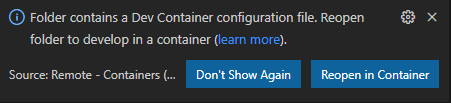

 # Using dev container
This repository contains a folder called ".devcontainer". 
When you'll open the project with Visual Studio Code, it will ask you to open the project in container mode provided some pre-requisites are installed on your machine.
## installing pre-requisites
You need to install the following pre-requisite on your machine

1. Install and configure [Docker](https://www.docker.com/get-started) for your operating system.

   - Windows / macOS:

     1. Install [Docker Desktop](https://www.docker.com/products/docker-desktop) for Windows/Mac.

     2. Right-click on the Docker task bar item, select Settings / Preferences and update Resources > File Sharing with any locations your source code is kept. See [tips and tricks](https://code.visualstudio.com/docs/remote/troubleshooting#_container-tips) for troubleshooting.

     3. If you are using WSL 2 on Windows, to enable the [Windows WSL 2 back-end](https://docs.docker.com/docker-for-windows/wsl/): Right-click on the Docker taskbar item and select Settings. Check Use the WSL 2 based engine and verify your distribution is enabled under Resources > WSL Integration.

   - Linux:

     1. Follow the official install [instructions for Docker CE/EE for your distribution](https://docs.docker.com/get-docker/). If you are using Docker Compose, follow the [Docker Compose directions](https://docs.docker.com/compose/install/) as well.

     2. Add your user to the docker group by using a terminal to run: sudo usermod -aG docker $USER

     3. Sign out and back in again so your changes take effect.

2. Install [Visual Studio Code](https://code.visualstudio.com/).

3. Install the [Remote Development extension pack](https://marketplace.visualstudio.com/items?itemName=ms-vscode-remote.vscode-remote-extensionpack)

## Using devcontainer

1. Launch Visual Studio Code in the folder where you stored the av-services repository

    ```bash
        c:\git\mini-services> code .
    ```

2. Once Visual Studio Code is launched, you should see the following dialgo box:

    

3. Click on the button 'Reopen in Container'
4. Visual Studio Code will now open the devcontainer. If it's the first time you open the project in container mode, it will first build the container.
5. Once the container is loaded, you can open a new terminal (Terminal -> New Terminal).
6. You have access to the tools installed in the devcontainer like ffmpeg, az cli, dootnet, docker cli,... You could use this devcontainer to stream video directly towards the virtual machines or containers  in Azure.

    ```bash
        vscode@d0b2b4ea7293:/workspace$ ffmpeg 
    ```
